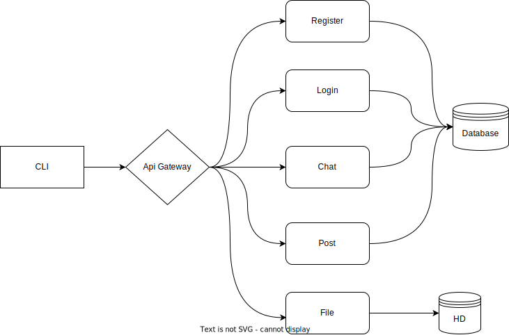

# Simple service mesh management protocole (SSMMP) with Microservices and PGP implementation

## Description

This project is a simple implementation of a microservices architecture using the PGP encryption algorithm.
Microservices are managed by Agent, which is responsible for managing the services and their communication.
Based on [documentation](https://github.com/sambrosz/SSMMP-a-simple-protocol-for-Service-Mesh-management).

## Microservices

Microservices are very simple and are connecting via Socket. Each service has its own port and is responsible for a specific task.

### Agent

Agent is responsible for managing the services and their communication. It is the main component of the system. It is responsible for:
- starting and closing services
- giving services data to connect
- closing unused connections

All services are connected to the agent.

### Api Gateway

Api Gateway is responsible for managing the communication between the client and the services. It is responsible for:
- authentication and veryfication of the client via:
  - public key
  - nonce
- forwarding decrypted messages to the services
- forwarding encrypted messages to the client

### Register

Register service is responsible for adding new users that are identified by their username and public key.

### Login

Login service is responsible for checking if the user is registered and if the public key is correct.

### Chat

Chat service is responsible for adding new messages to chat.

### Post

Post service is responsible for retreving 10 last messages from database.

### File

File service is responsible for:
- uploading files from the client
- downloading files to the client

## Requirements

- Java 22 Oracle OpenJDK 22.0.2
- PostgreSQL database with parameters specified in: `Service\src\Database\DatabaseDriver.java`
- Changing path in `Agent\src\ServiceInstance.java` to the absolute path of the project (I don't know how to fix it to have a relative path)